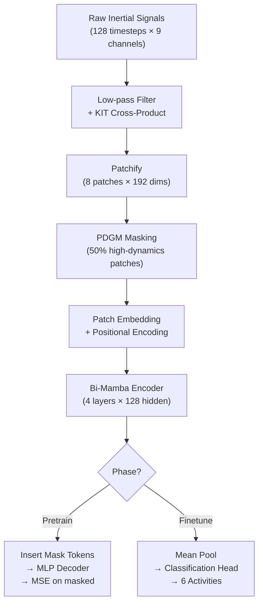

# HAR-Mamba: Project Walkthrough

> **Physics-Informed Self-Supervised HAR via Bidirectional State Space Models**

## Project Structure

```
CODE2/
├── config.py          # Central configuration (all hyperparameters)
├── dataset.py         # Data pipeline: load → filter → KIT → patchify
├── model.py           # BiMamba encoder, PDGM masking, autoencoder + classifier
├── pretrain.py        # Self-supervised pretraining loop
├── finetune.py        # Downstream fine-tuning & data scarcity experiments  
├── eval.py            # Standalone evaluation & artifact generation
├── utils.py           # Seeding, schedulers, metrics, visualisation
├── main.py            # Full pipeline entry point
├── requirements.txt   # Python dependencies
├── UCI HAR Dataset/   # Raw dataset (already present)
├── checkpoints/       # Saved model weights (created at runtime)
└── results/           # Metrics, plots, CSVs (created at runtime)
```

---

## The Three Core Novelties

### 1. Kinematic Interaction Tensor (KIT)

Instead of naively concatenating accelerometer and gyroscope streams, we compute a **cross-product** at every timestep:

$$F_{int,t} = a_t \times \omega_t$$

This captures rotational jerk and Coriolis-like effects — physically meaningful features that encode **richer motion semantics**. The final input per timestep is `[a_t, ω_t, total_acc_t, F_int_t]` = **12 channels** (up from 9 raw).

> [!IMPORTANT]
> KIT is computed in [dataset.py](file:///Users/shashank/HAR/CODE2/dataset.py) via `compute_kit()` (line ~100).

### 2. Probabilistic Dynamics-Guided Masking (PDGM)

We **abandon random masking** (MAE-style). Instead:

1. Compute motion intensity per patch: `I_p = mean_t ||Δx_t||₂`
2. Convert to probabilities via softmax with temperature τ
3. **High-dynamics patches have higher probability of being masked**
4. Sample without replacement using Gumbel-top-k

This forces the model to reconstruct the **most informative** movement transitions from static context alone.

> [!IMPORTANT]
> PDGM is implemented as a `nn.Module` in [model.py](file:///Users/shashank/HAR/CODE2/model.py) — the `PDGM` class (line ~220).

### 3. Bidirectional Mamba (BiMamba)

The encoder uses a **Bidirectional State Space Model** — processing sequences in both temporal directions:

```
Input ─┬── MambaBlock_fwd ──┐
       │                     ├── Gated Fusion → Output
       └── Flip → MambaBlock_bwd → Flip ──┘
```

Each `MambaBlock` uses a **Selective SSM** (S6-style) with input-dependent A, B, C, Δ projections. This gives **O(T) linear complexity** vs. O(T²) for Transformers.

> [!IMPORTANT]
> BiMambaBlock is in [model.py](file:///Users/shashank/HAR/CODE2/model.py) (line ~185). It stacks `num_layers=4` blocks.

---

## Architecture Summary



---

## Model Stats (verified ✅)

| Component | Value |
|---|---|
| Encoder params | 3,823,872 |
| Classification head params | 17,542 |
| Total params | **3,841,414** |
| Input shape | (B, 8 patches, 192 dim) |
| Hidden dim | 128 |
| SSM state dim | 16 |
| BiMamba layers | 4 |
| Mask ratio | 50% |

---

## Dataset: UCI HAR

| Split | Samples | Subjects |
|---|---|---|
| Train | 5,842 | 17 subjects |
| Validation | 1,510 | 4 subjects (21, 22, 23, 25) |
| Test | 2,947 | 9 subjects (2, 4, 9, 10, 12, 13, 18, 20, 24) |

**6 Activities**: WALKING, WALKING_UPSTAIRS, WALKING_DOWNSTAIRS, SITTING, STANDING, LAYING

> [!NOTE]
> The split is **subject-independent** — no data leakage between train/val/test.

---

## How to Run

### Full Pipeline (pretrain → finetune → eval)
```bash
python3 main.py
```

### Individual Phases
```bash
python3 main.py --phase pretrain      # Self-supervised pretraining
python3 main.py --phase finetune      # Full fine-tuning  
python3 main.py --phase linear        # Linear probe (frozen encoder)
python3 main.py --phase eval          # Generate evaluation artifacts
python3 main.py --phase scarcity      # Data scarcity experiment (1%-100%)
```

### Fine-tuning Options
```bash
python3 finetune.py --mode full --label-fraction 1.0
python3 finetune.py --mode linear_probe
python3 finetune.py --mode scarcity   # Runs at 1%, 5%, 10%, 25%, 100%
```

---

## Output Artifacts (for paper)

| File | Description |
|---|---|
| `results/metrics.csv` | Accuracy, Macro F1, Precision, Recall |
| `results/confusion_matrix.png` | Class-level performance heatmap |
| `results/tsne_embeddings.pdf` | Post-finetuning embedding visualisation |
| `results/tsne_pretrained.pdf` | Pre-finetuning embedding visualisation |
| `results/reconstruction_plot.png` | PDGM masking + reconstruction overlay |
| `results/data_scarcity_results.csv` | Label efficiency across fractions |
| `results/pretrain_log.csv` | Epoch-by-epoch pretraining loss |
| `results/finetune_*.csv` | Epoch-by-epoch finetuning metrics |

---

## Smoke Test Results ✅

Both the model architecture and data pipeline have been verified:

```
=== MaskedMambaAutoencoder ===
  Input patches:  (4, 8, 192)
  Reconstruction: (4, 8, 192)
  Mask:           (4, 8)  (masked=16/32)
  Loss:           1.0218
  Total |grad|:   1.4595  ✓ (gradients flow)

=== HARClassifier ===
  Logits:         (4, 6)

=== Dataset Pipeline ===
  train: patches (128, 8, 192)  labels (128,)  raw (128, 128, 12)
  val:   patches (128, 8, 192)  labels (128,)  raw (128, 128, 12)
  test:  patches (128, 8, 192)  labels (128,)  raw (128, 128, 12)
```
